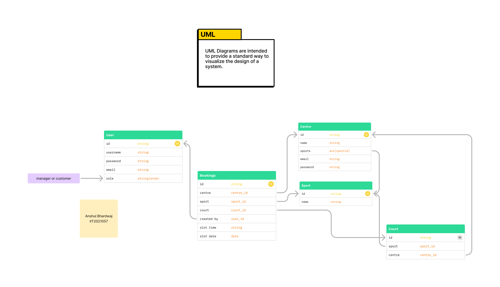
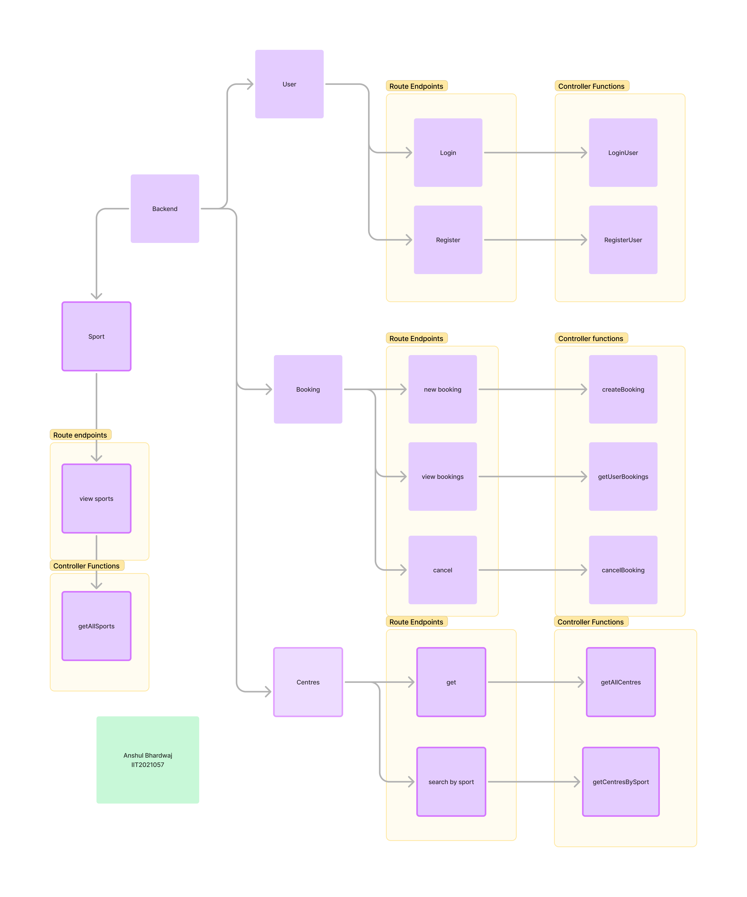

# Sports Booking Application
## IIT2021057


## Project Overview
The Sports Booking Application is a backend system for managing bookings of sports courts across various centers. It ensures role-based access control, with regular users able to view and manage their own bookings, while center managers can view and manage all bookings for their centers.


### Navigate into the backend directory:

```bash
cd backend_booking_app
```

### Install the required dependencies:

```bash
npm install
```

### Set up environment variables:
Create a `.env` file in the root directory with the following variables:

```plaintext
PORT=Input your desired port
MONGO_URI= add your mongo db cluster connection url
JWT_SECRET=add your jwt secret key
```

### Run the application:
Start the development server:

```bash
npm start
```

## UML Diagram
Below is the UML diagram showcasing the structure of the system:


## Flow Diagram
Here is the flow diagram outlining the booking process:


## API Endpoints

### Booking Routes:
- **POST** `/api/bookings`: Create a new booking (for both users and managers).
- **GET** `/api/bookings/my-bookings`: Retrieve all bookings made by the authenticated user.
- **DELETE** `/api/bookings/:booking_id`: Cancel a booking (only for the user who created it).

### User Routes:
- **POST** `/api/users/register`: Register a new user (either as a customer or manager).
- **POST** `/api/users/login`: Login and receive a JWT token.

### Centre Routes:
- **GET** `/api/centres`: Get all sports centers.
- **GET** `/api/centres/:sportId`: Retrieve centers offering a specific sport.

### Sport Routes:
- **GET** `/api/sports`: Retrieve all sports available in the system.

## Dependencies
- **express**: A minimal and flexible web framework for building APIs and handling HTTP requests and responses. It simplifies routing and middleware integration, making server-side development more efficient.
- **mongoose**: An ODM library for MongoDB that provides schema-based data modeling, allowing easier database interactions. It supports validation, queries, and relationships for managing MongoDB collections.
- **jsonwebtoken**: Used for securely authenticating users via tokens (JWT). It encodes user data in tokens, allowing stateless authentication by verifying the token on each request without needing sessions.
- **bcryptjs**: A library for securely hashing passwords and comparing them. It ensures passwords are stored safely using cryptographic hashing, protecting against data breaches.
- **dotenv**: A library for managing environment variables. It allows sensitive information (like API keys or database URLs) to be stored in a .env file, making it easier to configure and secure the application.
- **nodemon** (devDependency): A development tool that automatically restarts the Node.js server when file changes are detected. It speeds up development by eliminating the need for manual restarts.

## Assumptions & Limitations
- Bookings can only be created if the desired court and time slot are available.
- Users can view, create, and cancel only their own bookings.
- Managers can manage (view, create, and cancel) bookings for their assigned centers.

## Links
- [Deployed URL](https://sports-booking-frontend-2.onrender.com)

## Report

You can find the detailed project report [here](reportV2.pdf).
```
